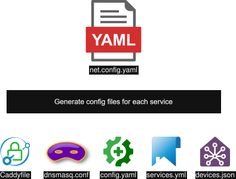

# net-config-gen

Config files generator for homelab network.

Centralize all your services configs into a root config file.
Avoid duplicates, improve consistency over your services and simplify maintenance.

<p align="center">
    
</p>

## Example

Checkout `example/example.config.yml` for a config example.
And check `example/generated` for possible results.

Note that generation filepaths are specified in config.

## Get started

```
npm run dev path/to/config.yml
```

Test with example:

```
npm run dev example/example.config.yml
```

## Data validation

Schema `net.schema.yml` can be used for data validation, from your editor or using validation tools.

For instance with VSCode extension YAML, you can add this comment on top of your config file:

```yml
# yaml-language-server: $schema=https://raw.githubusercontent.com/Chnapy/net-config-gen/refs/heads/main/net.schema.yml
```
